# Louisiana Enrollment Trends

``` r
library(laschooldata)
library(ggplot2)
library(dplyr)
library(scales)
```

``` r
theme_readme <- function() {
  theme_minimal(base_size = 14) +
    theme(
      plot.title = element_text(face = "bold", size = 16),
      plot.subtitle = element_text(color = "gray40"),
      panel.grid.minor = element_blank(),
      legend.position = "bottom"
    )
}

colors <- c("total" = "#2C3E50", "white" = "#3498DB", "black" = "#E74C3C",
            "hispanic" = "#F39C12", "asian" = "#9B59B6")
```

``` r
enr <- fetch_enr_multi(2019:2024, use_cache = TRUE)
enr_current <- fetch_enr(2024, use_cache = TRUE)

# Calculate state totals for percentage calculations
state_totals <- enr %>%
  filter(is_state, grade_level == "TOTAL", subgroup == "total_enrollment") %>%
  select(end_year, total = n_students)
```

## 1. Louisiana added 33,000 students since 2019

Statewide enrollment grew 5.1% from 2019 to 2024, rising from 644,000 to
677,000 students.

``` r
state_trend <- enr %>%
  filter(is_state, subgroup == "total_enrollment", grade_level == "TOTAL") %>%
  select(end_year, n_students)
stopifnot(nrow(state_trend) > 0)
state_trend
#> # A tibble: 6 × 2
#>   end_year n_students
#>      <int>      <dbl>
#> 1     2019     643986
#> 2     2020     624527
#> 3     2021     615839
#> 4     2022     685606
#> 5     2023     681176
#> 6     2024     676751

ggplot(state_trend, aes(x = end_year, y = n_students)) +
  geom_line(linewidth = 1.5, color = colors["total"]) +
  geom_point(size = 3, color = colors["total"]) +
  geom_vline(xintercept = 2021, linetype = "dashed", color = "red", alpha = 0.5) +
  annotate("text", x = 2021.1, y = max(state_trend$n_students), label = "COVID",
           hjust = 0, color = "red", alpha = 0.5) +
  scale_y_continuous(labels = comma, limits = c(0, NA)) +
  labs(title = "Louisiana Statewide Enrollment",
       subtitle = "5.1% growth from 2019 to 2024 (676,751 students)",
       x = "School Year", y = "Students") +
  theme_readme()
```

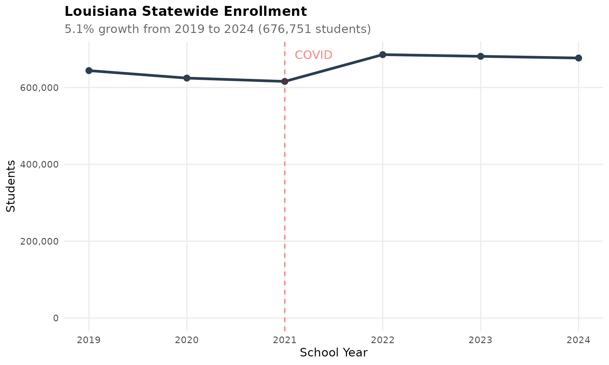

## 2. White students fell below Black students for the first time

White enrollment dropped from 47.1% in 2019 to 40.7% in 2024, while
Black students held steady at 41.7%, making Louisiana’s public schools
majority-minority.

``` r
demo <- enr %>%
  filter(is_state, grade_level == "TOTAL",
         subgroup %in% c("white", "black", "hispanic", "asian")) %>%
  left_join(state_totals, by = "end_year") %>%
  mutate(pct = n_students / total * 100)
stopifnot(nrow(demo) > 0)
demo %>% filter(end_year == 2024) %>% select(subgroup, n_students, pct)
#> # A tibble: 4 × 3
#>   subgroup n_students   pct
#>   <chr>         <dbl> <dbl>
#> 1 white        275265 40.7 
#> 2 black        282521 41.7 
#> 3 hispanic      77836 11.5 
#> 4 asian         10745  1.59

ggplot(demo, aes(x = end_year, y = pct, color = subgroup)) +
  geom_line(linewidth = 1.2) +
  geom_point(size = 2.5) +
  scale_color_manual(values = colors,
                     labels = c("Asian", "Black", "Hispanic", "White")) +
  labs(title = "Louisiana Demographics",
       subtitle = "White share fell from 47% to 41%, now below Black share",
       x = "School Year", y = "Percent of Students", color = "") +
  theme_readme()
```

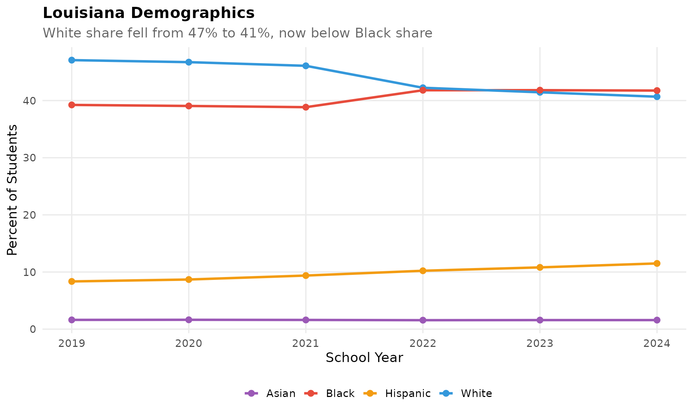

## 3. Hispanic enrollment surged 45% in five years

Hispanic students grew from 53,778 (8.4%) in 2019 to 77,836 (11.5%) in
2024, the fastest-growing demographic group in Louisiana schools.

``` r
hisp <- enr %>%
  filter(is_state, grade_level == "TOTAL", subgroup == "hispanic") %>%
  left_join(state_totals, by = "end_year") %>%
  mutate(pct = n_students / total * 100)
stopifnot(nrow(hisp) > 0)
hisp %>% select(end_year, n_students, pct)
#> # A tibble: 6 × 3
#>   end_year n_students   pct
#>      <int>      <dbl> <dbl>
#> 1     2019      53778  8.35
#> 2     2020      54251  8.69
#> 3     2021      57761  9.38
#> 4     2022      70054 10.2 
#> 5     2023      73627 10.8 
#> 6     2024      77836 11.5

ggplot(hisp, aes(x = end_year, y = n_students)) +
  geom_line(linewidth = 1.5, color = colors["hispanic"]) +
  geom_point(size = 3, color = colors["hispanic"]) +
  geom_vline(xintercept = 2021, linetype = "dashed", color = "red", alpha = 0.5) +
  scale_y_continuous(labels = comma) +
  labs(title = "Hispanic Enrollment Surging in Louisiana",
       subtitle = "45% growth from 53,778 to 77,836 students (2019-2024)",
       x = "School Year", y = "Hispanic Students") +
  theme_readme()
```

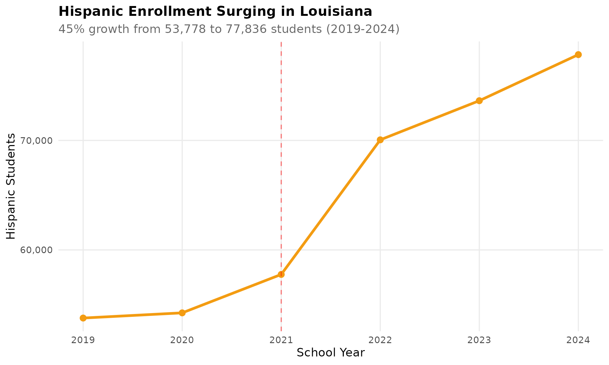

## 4. Jefferson Parish is Louisiana’s largest district

Jefferson Parish enrolls 47,702 students, leading all districts and
outpacing East Baton Rouge (39,932) and St. Tammany (36,384).

``` r
top5 <- enr_current %>%
  filter(is_district, subgroup == "total_enrollment", grade_level == "TOTAL",
         district_name != "State of Louisiana") %>%
  arrange(desc(n_students)) %>%
  head(5)
stopifnot(nrow(top5) > 0)
top5 %>% select(district_name, n_students)
#> # A tibble: 5 × 2
#>   district_name           n_students
#>   <chr>                        <dbl>
#> 1 Jefferson Parish             47702
#> 2 East Baton Rouge Parish      39932
#> 3 St. Tammany Parish           36384
#> 4 Caddo Parish                 32614
#> 5 Lafayette Parish             29877

top5_names <- top5$district_name

top5_trend <- enr %>%
  filter(is_district, district_name %in% top5_names,
         subgroup == "total_enrollment", grade_level == "TOTAL")
stopifnot(nrow(top5_trend) > 0)

ggplot(top5_trend, aes(x = end_year, y = n_students, color = district_name)) +
  geom_line(linewidth = 1.2) +
  geom_point(size = 2.5) +
  scale_y_continuous(labels = comma) +
  labs(title = "Louisiana's Five Largest Districts",
       subtitle = "Jefferson Parish leads with 47,702 students in 2024",
       x = "School Year", y = "Students", color = "") +
  theme_readme()
```

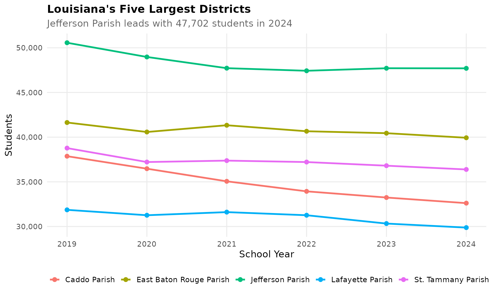

## 5. Caddo Parish lost 14% of its students in five years

Caddo Parish (Shreveport) dropped from 37,868 students in 2019 to 32,614
in 2024, a loss of over 5,200 students.

``` r
caddo <- enr %>%
  filter(is_district, district_name == "Caddo Parish",
         subgroup == "total_enrollment", grade_level == "TOTAL")
stopifnot(nrow(caddo) > 0)
caddo %>% select(end_year, district_name, n_students)
#> # A tibble: 6 × 3
#>   end_year district_name n_students
#>      <int> <chr>              <dbl>
#> 1     2019 Caddo Parish       37868
#> 2     2020 Caddo Parish       36470
#> 3     2021 Caddo Parish       35057
#> 4     2022 Caddo Parish       33934
#> 5     2023 Caddo Parish       33243
#> 6     2024 Caddo Parish       32614

ggplot(caddo, aes(x = end_year, y = n_students)) +
  geom_line(linewidth = 1.5, color = colors["total"]) +
  geom_point(size = 3, color = colors["total"]) +
  scale_y_continuous(labels = comma, limits = c(0, NA)) +
  labs(title = "Caddo Parish (Shreveport) Enrollment Decline",
       subtitle = "Lost 5,254 students (-13.9%) from 2019 to 2024",
       x = "School Year", y = "Students") +
  theme_readme()
```

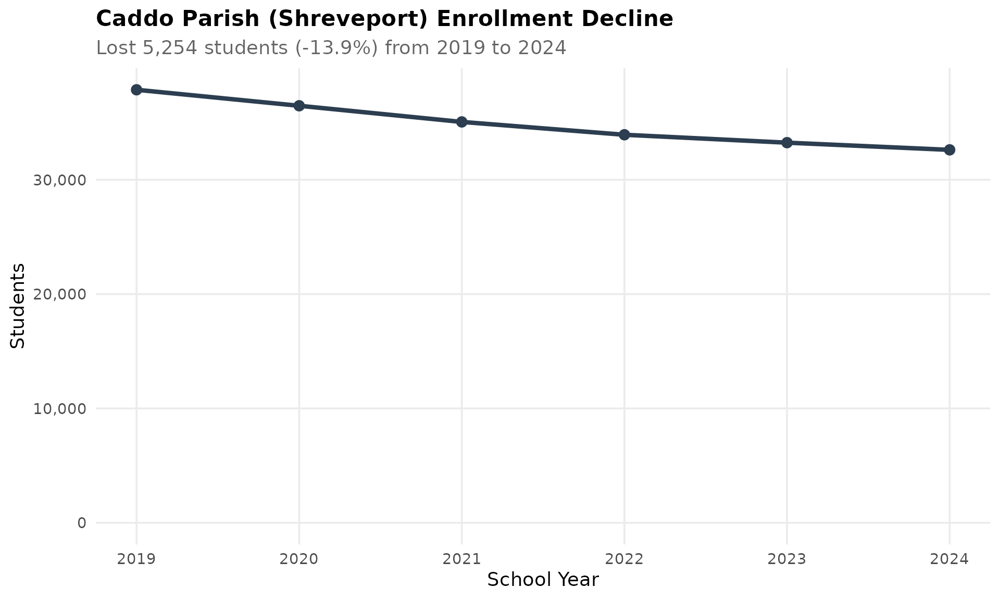

## 6. COVID wiped out 17% of Pre-K enrollment overnight

Pre-K dropped from 26,078 to 21,751 students between 2019 and 2020, then
slowly recovered to 26,152 by 2024.

``` r
prek <- enr %>%
  filter(is_state, subgroup == "total_enrollment", grade_level == "PK")
stopifnot(nrow(prek) > 0)
prek %>% select(end_year, n_students)
#> # A tibble: 6 × 2
#>   end_year n_students
#>      <int>      <dbl>
#> 1     2019      26078
#> 2     2020      21751
#> 3     2021      24027
#> 4     2022      25969
#> 5     2023      26002
#> 6     2024      26152

ggplot(prek, aes(x = end_year, y = n_students)) +
  geom_line(linewidth = 1.5, color = colors["total"]) +
  geom_point(size = 3, color = colors["total"]) +
  geom_vline(xintercept = 2020.5, linetype = "dashed", color = "red", alpha = 0.5) +
  annotate("text", x = 2020.6, y = max(prek$n_students), label = "COVID",
           hjust = 0, color = "red", alpha = 0.5) +
  scale_y_continuous(labels = comma) +
  labs(title = "Pre-K Enrollment Cratered During COVID",
       subtitle = "-16.6% drop in 2020, full recovery by 2024",
       x = "School Year", y = "Pre-K Students") +
  theme_readme()
```

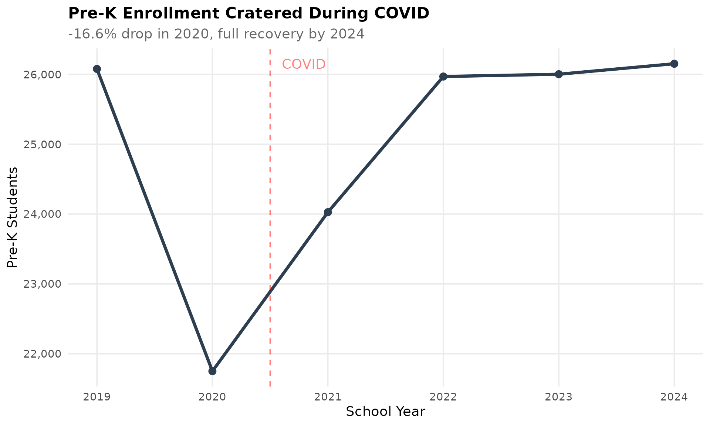

## 7. Kindergarten also took a COVID hit

Kindergarten enrollment fell 6.9% from 48,556 to 45,205 between 2019 and
2020, and still has not returned to pre-pandemic levels.

``` r
k_trend <- enr %>%
  filter(is_state, subgroup == "total_enrollment",
         grade_level %in% c("PK", "K", "01", "09")) %>%
  mutate(grade_label = case_when(
    grade_level == "PK" ~ "Pre-K",
    grade_level == "K" ~ "Kindergarten",
    grade_level == "01" ~ "Grade 1",
    grade_level == "09" ~ "Grade 9"
  ))
stopifnot(nrow(k_trend) > 0)
k_trend %>%
  filter(grade_level == "K") %>%
  select(end_year, grade_label, n_students)
#> # A tibble: 6 × 3
#>   end_year grade_label  n_students
#>      <int> <chr>             <dbl>
#> 1     2019 Kindergarten      48556
#> 2     2020 Kindergarten      45205
#> 3     2021 Kindergarten      46282
#> 4     2022 Kindergarten      50345
#> 5     2023 Kindergarten      48798
#> 6     2024 Kindergarten      48084

ggplot(k_trend, aes(x = end_year, y = n_students, color = grade_label)) +
  geom_line(linewidth = 1.2) +
  geom_point(size = 2.5) +
  geom_vline(xintercept = 2020.5, linetype = "dashed", color = "red", alpha = 0.5) +
  annotate("text", x = 2020.6, y = max(k_trend$n_students), label = "COVID",
           hjust = 0, color = "red", alpha = 0.5) +
  scale_y_continuous(labels = comma) +
  labs(title = "COVID Impact by Grade Level",
       subtitle = "Youngest grades hit hardest, K still below pre-pandemic levels",
       x = "School Year", y = "Students", color = "") +
  theme_readme()
```

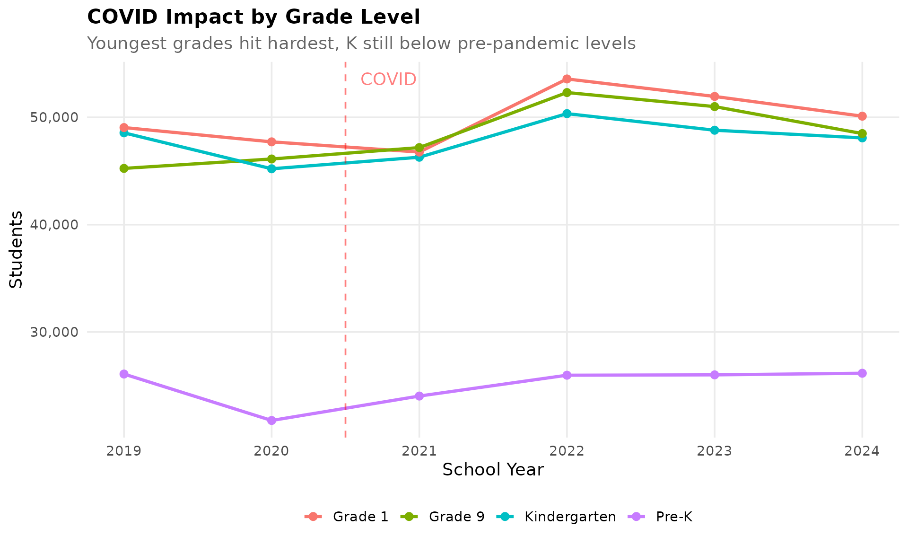

## 8. English learners grew from 3.9% to 5.3% of enrollment

LEP students increased from 24,908 to 35,868 between 2019 and 2024, a
44% jump tracking closely with Hispanic growth.

``` r
el <- enr %>%
  filter(is_state, subgroup == "lep", grade_level == "TOTAL") %>%
  left_join(state_totals, by = "end_year") %>%
  mutate(pct = n_students / total * 100)
stopifnot(nrow(el) > 0)
el %>% select(end_year, n_students, pct)
#> # A tibble: 6 × 3
#>   end_year n_students   pct
#>      <int>      <dbl> <dbl>
#> 1     2019      24908  3.87
#> 2     2020      23336  3.74
#> 3     2021      25194  4.09
#> 4     2022      31939  4.66
#> 5     2023      33847  4.97
#> 6     2024      35868  5.30

ggplot(el, aes(x = end_year, y = pct)) +
  geom_line(linewidth = 1.5, color = colors["total"]) +
  geom_point(size = 3, color = colors["total"]) +
  labs(title = "English Learners on the Rise",
       subtitle = "From 3.9% to 5.3% of enrollment (2019-2024)",
       x = "School Year", y = "Percent of Students") +
  theme_readme()
```

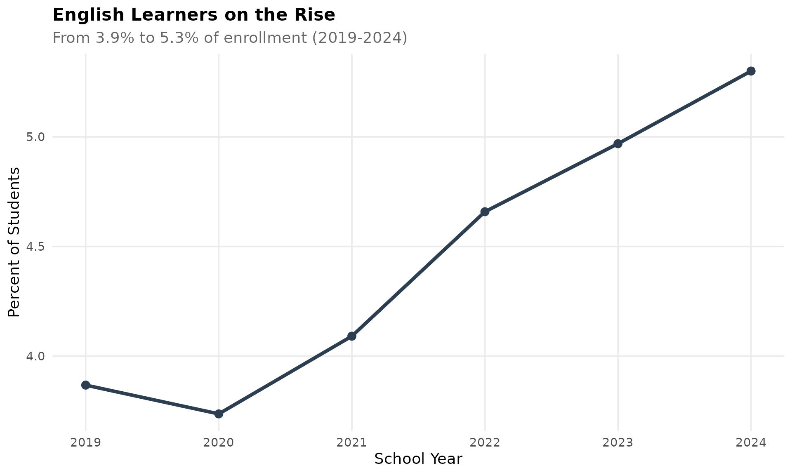

## 9. Seven in ten Louisiana students are economically disadvantaged

The statewide economic disadvantage rate has hovered around 70% since
2019, one of the highest rates in the nation.

``` r
econ_state <- enr %>%
  filter(is_state, subgroup == "econ_disadv", grade_level == "TOTAL") %>%
  left_join(state_totals, by = "end_year") %>%
  mutate(pct = n_students / total * 100)
stopifnot(nrow(econ_state) > 0)
econ_state %>% select(end_year, n_students, pct)
#> # A tibble: 6 × 3
#>   end_year n_students   pct
#>      <int>      <dbl> <dbl>
#> 1     2019     436524  67.8
#> 2     2020     453025  72.5
#> 3     2021     429803  69.8
#> 4     2022     494310  72.1
#> 5     2023     494076  72.5
#> 6     2024     474402  70.1

ggplot(econ_state, aes(x = end_year, y = pct)) +
  geom_line(linewidth = 1.5, color = colors["total"]) +
  geom_point(size = 3, color = colors["total"]) +
  scale_y_continuous(limits = c(60, 80)) +
  labs(title = "Economic Disadvantage Rate in Louisiana",
       subtitle = "Consistently around 70% statewide",
       x = "School Year", y = "Percent Economically Disadvantaged") +
  theme_readme()
```

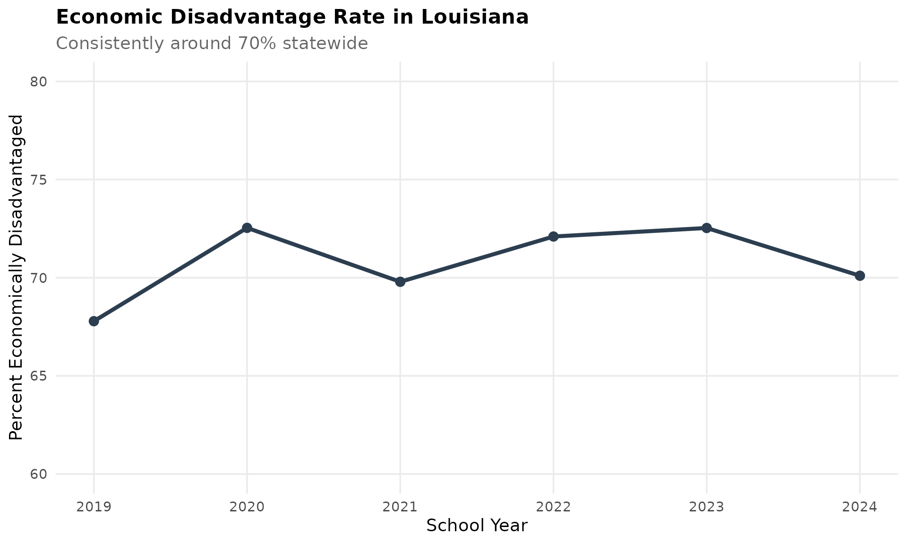

## 10. St. Helena Parish: 100% economically disadvantaged

St. Helena leads Louisiana with every single student classified as
economically disadvantaged, followed by East Carroll (96.9%) and Tensas
(95.8%).

``` r
district_totals <- enr_current %>%
  filter(is_district, subgroup == "total_enrollment", grade_level == "TOTAL") %>%
  select(district_name, total = n_students)

econ <- enr_current %>%
  filter(is_district, subgroup == "econ_disadv", grade_level == "TOTAL") %>%
  left_join(district_totals, by = "district_name") %>%
  mutate(pct = n_students / total * 100) %>%
  arrange(desc(pct)) %>%
  head(10) %>%
  mutate(district_label = reorder(district_name, pct))
stopifnot(nrow(econ) > 0)
econ %>% select(district_name, n_students, total, pct)
#> # A tibble: 10 × 4
#>    district_name                    n_students total   pct
#>    <chr>                                 <dbl> <dbl> <dbl>
#>  1 St. Helena Parish                      1002  1002 100  
#>  2 Special School District                 291   299  97.3
#>  3 East Carroll Parish                     715   738  96.9
#>  4 Tensas Parish                           298   311  95.8
#>  5 Madison Parish                         1078  1134  95.1
#>  6 Thrive Academy                          152   161  94.4
#>  7 City of Bogalusa School District       1718  1822  94.3
#>  8 City of Baker School District           927   999  92.8
#>  9 Red River Parish                       1143  1251  91.4
#> 10 Natchitoches Parish                    4230  4829  87.6

ggplot(econ, aes(x = district_label, y = pct)) +
  geom_col(fill = colors["total"]) +
  coord_flip() +
  labs(title = "Highest Poverty Districts in Louisiana",
       subtitle = "St. Helena Parish reports 100% economically disadvantaged",
       x = "", y = "Percent Economically Disadvantaged") +
  theme_readme()
```

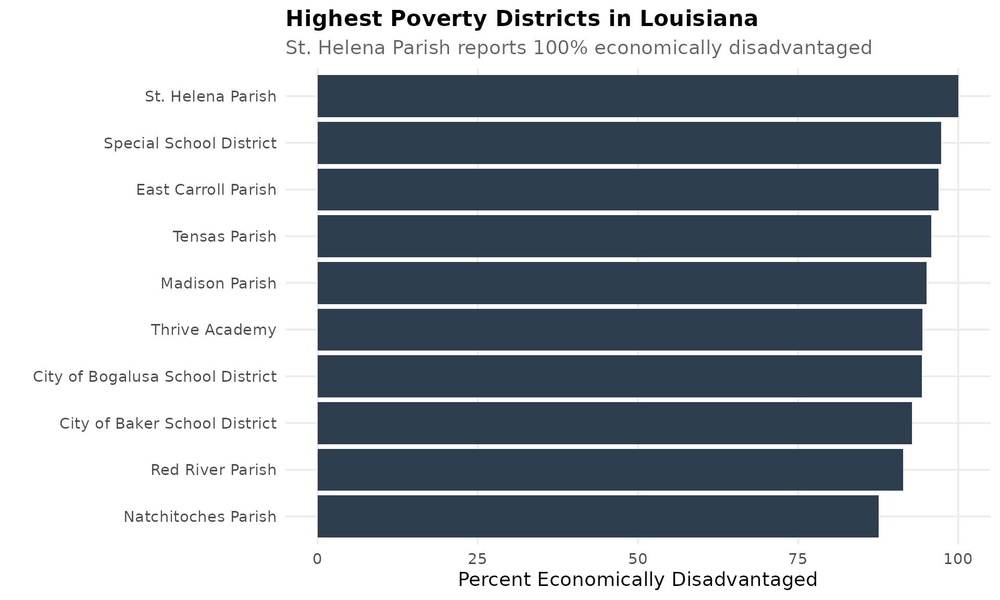

## 11. Delta parishes are emptying out

East Carroll (-20.8%), Tensas (-22.6%), and Madison (-4.4%) have shed
students steadily since 2019.

``` r
delta_names <- c("Tensas Parish", "East Carroll Parish", "Madison Parish")
delta_trend <- enr %>%
  filter(is_district, district_name %in% delta_names,
         subgroup == "total_enrollment", grade_level == "TOTAL")
stopifnot(nrow(delta_trend) > 0)
delta_trend %>% select(end_year, district_name, n_students)
#> # A tibble: 18 × 3
#>    end_year district_name       n_students
#>       <int> <chr>                    <dbl>
#>  1     2019 East Carroll Parish        932
#>  2     2019 Madison Parish            1186
#>  3     2019 Tensas Parish              402
#>  4     2020 East Carroll Parish        836
#>  5     2020 Madison Parish            1102
#>  6     2020 Tensas Parish              355
#>  7     2021 East Carroll Parish        778
#>  8     2021 Madison Parish            1163
#>  9     2021 Tensas Parish              334
#> 10     2022 East Carroll Parish        770
#> 11     2022 Madison Parish            1223
#> 12     2022 Tensas Parish              331
#> 13     2023 East Carroll Parish        751
#> 14     2023 Madison Parish            1244
#> 15     2023 Tensas Parish              328
#> 16     2024 East Carroll Parish        738
#> 17     2024 Madison Parish            1134
#> 18     2024 Tensas Parish              311

delta_combined <- delta_trend %>%
  group_by(end_year) %>%
  summarize(n_students = sum(n_students, na.rm = TRUE), .groups = "drop")
delta_combined
#> # A tibble: 6 × 2
#>   end_year n_students
#>      <int>      <dbl>
#> 1     2019       2520
#> 2     2020       2293
#> 3     2021       2275
#> 4     2022       2324
#> 5     2023       2323
#> 6     2024       2183

ggplot(delta_trend, aes(x = end_year, y = n_students, color = district_name)) +
  geom_line(linewidth = 1.2) +
  geom_point(size = 2.5) +
  scale_y_continuous(labels = comma) +
  labs(title = "Delta Parishes Losing Students",
       subtitle = "Tensas, East Carroll, and Madison combined lost 13.4% since 2019",
       x = "School Year", y = "Students", color = "") +
  theme_readme()
```

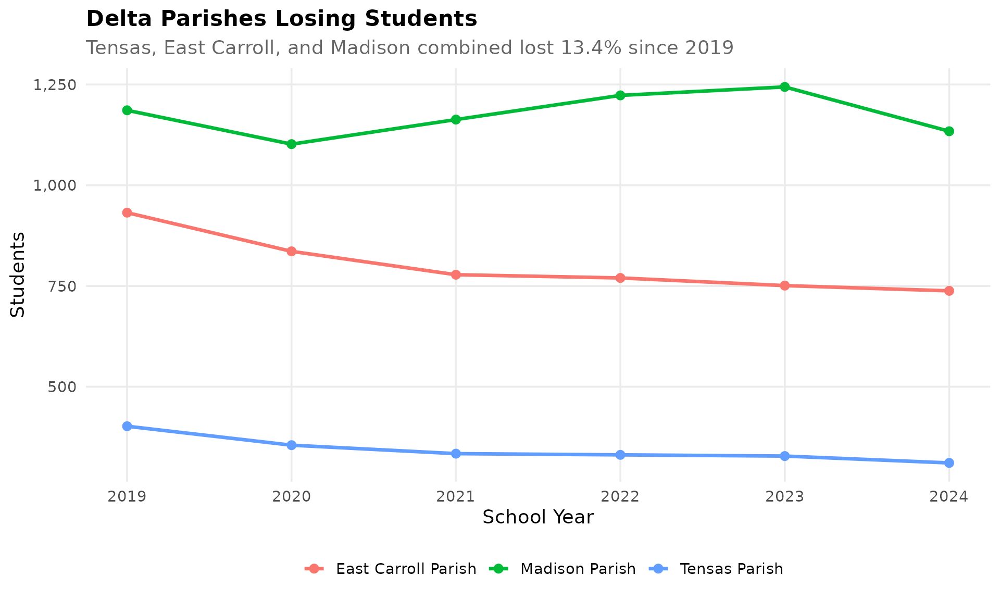

## 12. Calcasieu Parish never recovered from Hurricane Laura

Calcasieu Parish (Lake Charles) lost 11.3% of enrollment in a single
year (2019-2020) after Hurricane Laura devastated southwest Louisiana.

``` r
calcasieu <- enr %>%
  filter(is_district, district_name == "Calcasieu Parish",
         subgroup == "total_enrollment", grade_level == "TOTAL")
stopifnot(nrow(calcasieu) > 0)
calcasieu %>% select(end_year, district_name, n_students)
#> # A tibble: 6 × 3
#>   end_year district_name    n_students
#>      <int> <chr>                 <dbl>
#> 1     2019 Calcasieu Parish      31879
#> 2     2020 Calcasieu Parish      28265
#> 3     2021 Calcasieu Parish      27681
#> 4     2022 Calcasieu Parish      27871
#> 5     2023 Calcasieu Parish      28392
#> 6     2024 Calcasieu Parish      28623

ggplot(calcasieu, aes(x = end_year, y = n_students)) +
  geom_line(linewidth = 1.5, color = colors["total"]) +
  geom_point(size = 3, color = colors["total"]) +
  geom_vline(xintercept = 2020, linetype = "dashed", color = "red", alpha = 0.5) +
  annotate("text", x = 2020.1, y = 31500, label = "Hurricane Laura",
           hjust = 0, color = "red", alpha = 0.5) +
  scale_y_continuous(labels = comma, limits = c(0, NA)) +
  labs(title = "Calcasieu Parish (Lake Charles)",
       subtitle = "Lost 3,600 students after Hurricane Laura, partial recovery",
       x = "School Year", y = "Students") +
  theme_readme()
```

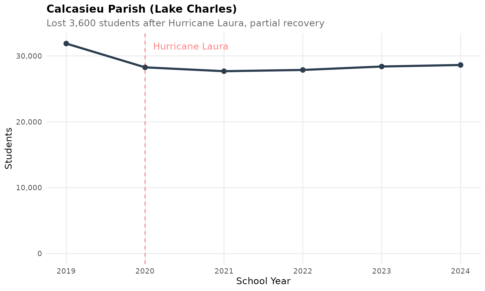

## 13. Jefferson Parish: the slow suburban slide

Louisiana’s largest district has been quietly losing students, dropping
from 50,566 in 2019 to 47,702 in 2024.

``` r
jefferson <- enr %>%
  filter(is_district, district_name == "Jefferson Parish",
         subgroup == "total_enrollment", grade_level == "TOTAL")
stopifnot(nrow(jefferson) > 0)
jefferson %>% select(end_year, district_name, n_students)
#> # A tibble: 6 × 3
#>   end_year district_name    n_students
#>      <int> <chr>                 <dbl>
#> 1     2019 Jefferson Parish      50566
#> 2     2020 Jefferson Parish      48974
#> 3     2021 Jefferson Parish      47720
#> 4     2022 Jefferson Parish      47429
#> 5     2023 Jefferson Parish      47712
#> 6     2024 Jefferson Parish      47702

ggplot(jefferson, aes(x = end_year, y = n_students)) +
  geom_line(linewidth = 1.5, color = colors["total"]) +
  geom_point(size = 3, color = colors["total"]) +
  scale_y_continuous(labels = comma, limits = c(0, NA)) +
  labs(title = "Jefferson Parish - Largest but Shrinking",
       subtitle = "Lost 2,864 students (-5.7%) from 2019 to 2024",
       x = "School Year", y = "Students") +
  theme_readme()
```

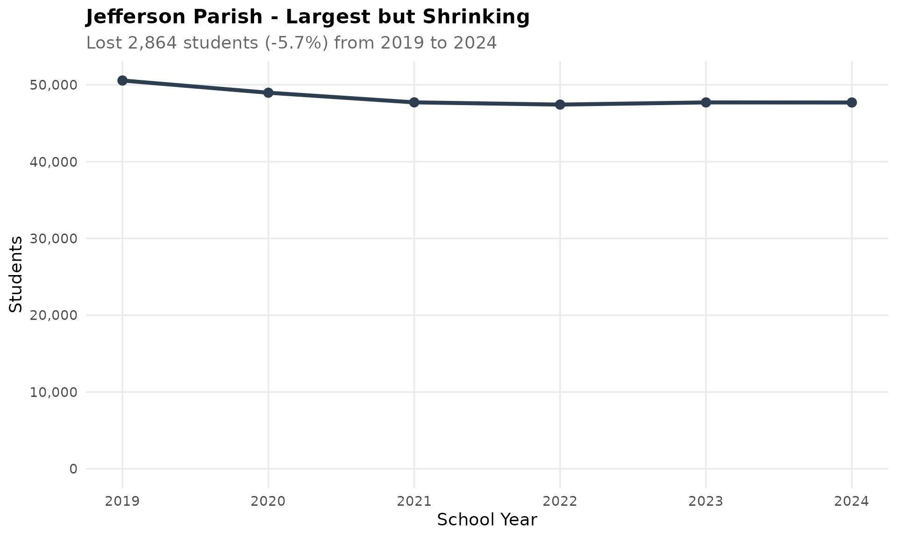

## 14. The suburban corridor holds steady

Ascension, Livingston, and St. Tammany parishes along the I-10/I-12
corridor are among the few growing districts.

``` r
i10 <- c("Livingston Parish", "Ascension Parish", "St. Tammany Parish")
i10_trend <- enr %>%
  filter(is_district, district_name %in% i10,
         subgroup == "total_enrollment", grade_level == "TOTAL")
stopifnot(nrow(i10_trend) > 0)
i10_trend %>%
  select(end_year, district_name, n_students) %>%
  tidyr::pivot_wider(names_from = district_name, values_from = n_students)
#> # A tibble: 6 × 4
#>   end_year `Ascension Parish` `Livingston Parish` `St. Tammany Parish`
#>      <int>              <dbl>               <dbl>                <dbl>
#> 1     2019              23409               26148                38774
#> 2     2020              23455               26044                37214
#> 3     2021              23843               26540                37374
#> 4     2022              24041               26954                37212
#> 5     2023              24138               27105                36806
#> 6     2024              24076               26852                36384

ggplot(i10_trend, aes(x = end_year, y = n_students, color = district_name)) +
  geom_line(linewidth = 1.2) +
  geom_point(size = 2.5) +
  scale_y_continuous(labels = comma) +
  labs(title = "I-10/I-12 Corridor Parishes",
       subtitle = "Ascension and Livingston growing; St. Tammany stable",
       x = "School Year", y = "Students", color = "") +
  theme_readme()
```

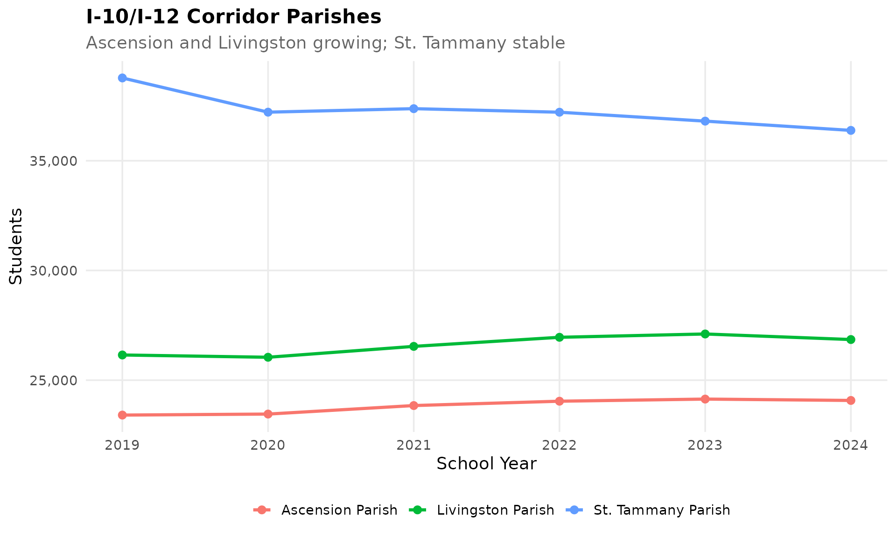

## 15. Gender balance is remarkably stable

Louisiana’s 51.2% male / 48.8% female split has barely budged across all
six years of data.

``` r
gender <- enr %>%
  filter(is_state, grade_level == "TOTAL",
         subgroup %in% c("male", "female")) %>%
  left_join(state_totals, by = "end_year") %>%
  mutate(pct = n_students / total * 100)
stopifnot(nrow(gender) > 0)
gender %>%
  filter(end_year == 2024) %>%
  select(subgroup, n_students, pct)
#> # A tibble: 2 × 3
#>   subgroup n_students   pct
#>   <chr>         <dbl> <dbl>
#> 1 male         346497  51.2
#> 2 female       330254  48.8

ggplot(gender, aes(x = end_year, y = pct, color = subgroup)) +
  geom_line(linewidth = 1.2) +
  geom_point(size = 2.5) +
  scale_color_manual(values = c("male" = "#3498DB", "female" = "#E74C3C"),
                     labels = c("Female", "Male")) +
  scale_y_continuous(limits = c(45, 55)) +
  labs(title = "Gender Balance in Louisiana Schools",
       subtitle = "Consistently 51.2% male / 48.8% female since 2019",
       x = "School Year", y = "Percent of Students", color = "") +
  theme_readme()
```

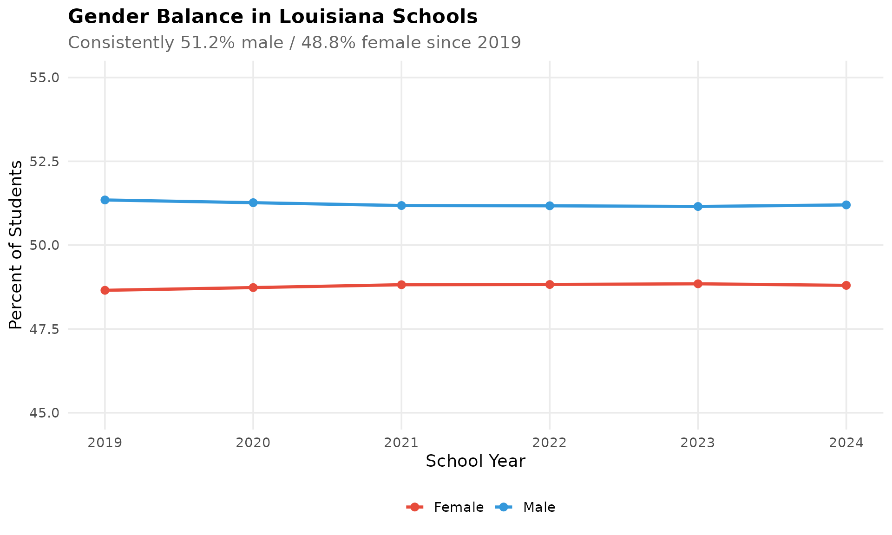

## Session Info

``` r
sessionInfo()
#> R version 4.5.2 (2025-10-31)
#> Platform: x86_64-pc-linux-gnu
#> Running under: Ubuntu 24.04.3 LTS
#> 
#> Matrix products: default
#> BLAS:   /usr/lib/x86_64-linux-gnu/openblas-pthread/libblas.so.3 
#> LAPACK: /usr/lib/x86_64-linux-gnu/openblas-pthread/libopenblasp-r0.3.26.so;  LAPACK version 3.12.0
#> 
#> locale:
#>  [1] LC_CTYPE=C.UTF-8       LC_NUMERIC=C           LC_TIME=C.UTF-8       
#>  [4] LC_COLLATE=C.UTF-8     LC_MONETARY=C.UTF-8    LC_MESSAGES=C.UTF-8   
#>  [7] LC_PAPER=C.UTF-8       LC_NAME=C              LC_ADDRESS=C          
#> [10] LC_TELEPHONE=C         LC_MEASUREMENT=C.UTF-8 LC_IDENTIFICATION=C   
#> 
#> time zone: UTC
#> tzcode source: system (glibc)
#> 
#> attached base packages:
#> [1] stats     graphics  grDevices utils     datasets  methods   base     
#> 
#> other attached packages:
#> [1] scales_1.4.0       dplyr_1.2.0        ggplot2_4.0.2      laschooldata_0.1.0
#> 
#> loaded via a namespace (and not attached):
#>  [1] tidyr_1.3.2        rappdirs_0.3.4     sass_0.4.10        utf8_1.2.6        
#>  [5] generics_0.1.4     stringi_1.8.7      digest_0.6.39      magrittr_2.0.4    
#>  [9] evaluate_1.0.5     grid_4.5.2         timechange_0.4.0   RColorBrewer_1.1-3
#> [13] fastmap_1.2.0      cellranger_1.1.0   jsonlite_2.0.0     httr_1.4.8        
#> [17] purrr_1.2.1        codetools_0.2-20   textshaping_1.0.5  jquerylib_0.1.4   
#> [21] cli_3.6.5          rlang_1.1.7        withr_3.0.2        cachem_1.1.0      
#> [25] yaml_2.3.12        otel_0.2.0         tools_4.5.2        curl_7.0.0        
#> [29] vctrs_0.7.1        R6_2.6.1           lifecycle_1.0.5    lubridate_1.9.5   
#> [33] snakecase_0.11.1   stringr_1.6.0      fs_1.6.7           htmlwidgets_1.6.4 
#> [37] ragg_1.5.1         janitor_2.2.1      pkgconfig_2.0.3    desc_1.4.3        
#> [41] pkgdown_2.2.0      pillar_1.11.1      bslib_0.10.0       gtable_0.3.6      
#> [45] glue_1.8.0         systemfonts_1.3.2  xfun_0.56          tibble_3.3.1      
#> [49] tidyselect_1.2.1   knitr_1.51         farver_2.1.2       htmltools_0.5.9   
#> [53] rmarkdown_2.30     labeling_0.4.3     compiler_4.5.2     S7_0.2.1          
#> [57] readxl_1.4.5
```
